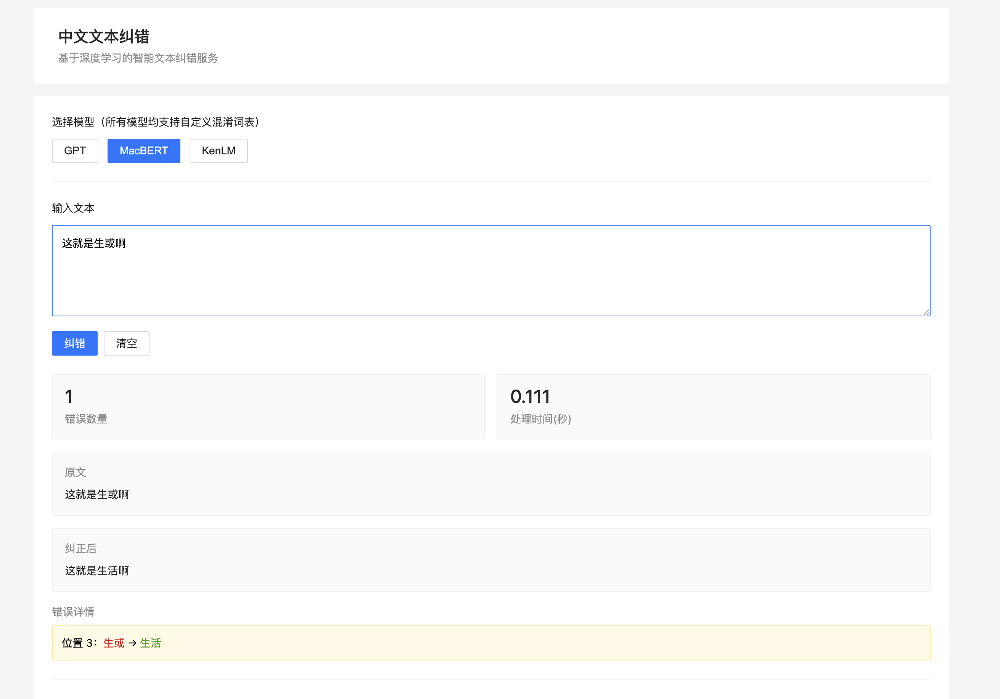

# 中文文本纠错服务

## 简介

本项目基于FastAPI和PyTorch实现了一个中文文本纠错服务，支持多种纠错模型和大模型深度检测。

## 功能特性

### 支持的模型

| 模型 | 类型 | 特点 | 适用场景 |
|------|------|------|---------|
| **GPT** | 深度学习 | BERT + 混淆词表 | 通用纠错 |
| **MacBERT** | 深度学习 | 专门训练的拼写检查 | 字符级错误 |
| **KenLM** | 统计模型 | 轻量级统计语言模型 | 快速纠错 |
| **Qwen** ⭐ | 大模型 | LangChain  | 深度语义检测 |


**核心优势：**
- **位置准确**：不依赖大模型
- **深度语义理解**：检测词语搭配不当、逻辑错误、表达问题
- **详细错误分析**：提供错误类型（typo/semantic/grammar）和原因解释
- **性价比极高**：qwen-turbo 仅 ¥0.06/千次（每天1000次 = ¥1.8/月）

### 传统模型（BERT/GPT/KenLM）

- 支持自定义混淆词表
- 本地运行，无调用成本
- 擅长错别字、形近字、音近字检测

## 示例



## 安装使用

### 1. 安装依赖

```bash
pdm install
```

**如果遇到网络超时（国内环境）：**

```bash
# 配置清华大学镜像源（推荐）
pdm config pypi.url https://pypi.tuna.tsinghua.edu.cn/simple

# 或使用阿里云镜像
# pdm config pypi.url https://mirrors.aliyun.com/pypi/simple/

# 然后重新安装
pdm install
```

### 2. 配置 Qwen API Key（可选）

如果要使用 Qwen 大模型，需要配置 API Key：

创建 `.env` 文件：
```
DASHSCOPE_API_KEY=your-api-key-here
```

**获取 API Key:**
1. 注册阿里云账号：https://dashscope.console.aliyun.com/
2. 开通 DashScope 服务
3. 新用户赠送 100万 tokens 免费额度

### 3. 启动服务

```bash
pdm run start
```

服务将在 http://localhost:8000 启动

### 4. 使用

**Web 界面：** 访问 http://localhost:8000

**API 调用示例：**

```bash
# BERT 纠错（本地，免费）
curl -X POST "http://localhost:8000/correct" \
  -H "Content-Type: application/json" \
  -d '{"text": "今天新情很好", "model_type": "gpt"}'

# Qwen 深度检测（需要 API Key）
curl -X POST "http://localhost:8000/correct" \
  -H "Content-Type: application/json" \
  -d '{"text": "我喝了一杯椅子", "model_type": "qwen"}'
```


## 技术栈

- **FastAPI**: Web 框架
- **PyCorrector**: 文本纠错引擎
- **LangChain**: 大模型调用框架
- **Qwen (千问)**: 阿里云大模型
- **PyTorch**: 深度学习框架